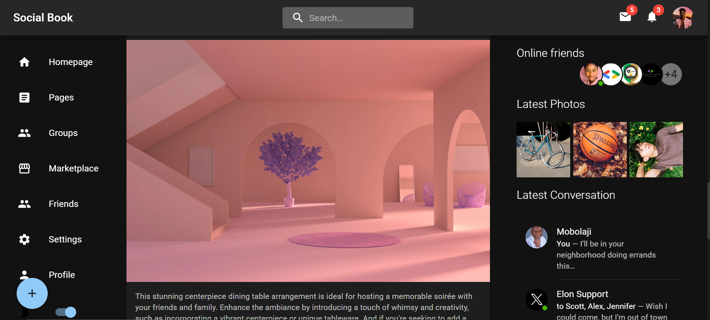

# SOCIALBOOK - Your Social Media Playground



**SOCIALBOOK** is a social media website built as a practice project to help improve my Frontend skills(CSS) using React, Vite, and Material-UI. It offers a simple yet functional platform for users to share their thoughts, interact with others, and explore a world of connections. 

This project is designed to help me learn and showcase my proficiency in using Material-UI to create a visually appealing and responsive web application.

## Features

- User profiles with avatars and basic information
- News feed for posting and interacting with posts
- Like and comment on posts
- Follow and be followed by other users
- Responsive design for various screen sizes
- Material-UI theming for beautiful and consistent styling

## Getting Started

To get SOCIALBOOK up and running on your local development environment, follow these steps:

### Prerequisites

Make sure you have the following installed:

- [Node.js](https://nodejs.org/)
- [npm](https://www.npmjs.com/) or [Yarn](https://yarnpkg.com/)

### Installation

1. Clone the repository to your local machine:

```bash
git clone https://github.com/Laycon-devs/SocialBook.git
```

2. Navigate to the project folder:

```bash
cd google-Mui
```

3. Install project dependencies using npm or Yarn:

```bash
# Using npm
npm install

# Using Yarn
yarn
```

### Configuration

<!-- 1. Configure your environment variables by creating a `.env` file in the project root. You'll need to set up environment variables for authentication, database connections, and any other necessary settings. -->

1. Start the development server:

```bash
npm run dev
```

3. Open your browser and visit [http://localhost:3000](http://localhost:3000) to see SOCIALBOOK in action!

## Contributing

We welcome contributions to make SOCIALBOOK better and more feature-rich. If you'd like to contribute, please follow these steps:

1. Fork the repository to your GitHub account.

2. Create a new branch from the `main` branch for your feature or bug fix:

```bash
git checkout -b feature-or-bugfix-name
```

3. Make your changes, test them thoroughly, and ensure your code follows the project's coding standards.

4. Push your changes to your forked repository:

```bash
git push origin feature-or-bugfix-name
```

5. Create a pull request (PR) to the `main` branch of the original repository.

We'll review your PR, provide feedback, and merge it when ready.

## License

This project is licensed under the [MIT License](LICENSE). You are free to use and modify the code for your personal or educational projects.

## Acknowledgments

- This project is inspired by the need to improve CSS skills with Material-UI.
- We thank the open-source community for their invaluable contributions.

Happy coding!

---